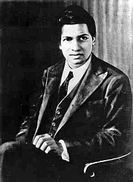

<table class="infobox biography vcard">
<tbody>
<tr>
<th colspan="2">

Srinivasa Ramanujan

 

<a title="Fellow of the Royal Society" href="https://en.wikipedia.org/wiki/Fellow_of_the_Royal_Society">FRS</a>

</th>
</tr>
<tr>
<td colspan="2"></td>
</tr>
<tr>
<th scope="row">Born</th>
<td>22 December 1887 

<a title="Erode" href="https://en.wikipedia.org/wiki/Erode">Erode</a>,&nbsp;<a title="Madras Presidency" href="https://en.wikipedia.org/wiki/Madras_Presidency">Madras Presidency</a>,&nbsp;<a title="British Raj" href="https://en.wikipedia.org/wiki/British_Raj">British India</a>

</td>
</tr>
<tr>
<th scope="row">Died</th>
<td>26 April 1920&nbsp;(aged&nbsp;32) 

<a title="Kumbakonam" href="https://en.wikipedia.org/wiki/Kumbakonam">Kumbakonam</a>,&nbsp;<a title="Madras Presidency" href="https://en.wikipedia.org/wiki/Madras_Presidency">Madras Presidency</a>,&nbsp;<a title="British Raj" href="https://en.wikipedia.org/wiki/British_Raj">British India</a>

</td>
</tr>
<tr>
<th scope="row">Nationality</th>
<td class="category"><a class="mw-redirect" title="British India" href="https://en.wikipedia.org/wiki/British_India">British India</a></td>
</tr>
<tr>
<th scope="row">Other&nbsp;names</th>
<td class="nickname">Srinivasa Ramanujan Aiyangar</td>
</tr>
<tr>
<th scope="row">Education</th>
<td>

<ul>
<li><a title="Government Arts College, Kumbakonam" href="https://en.wikipedia.org/wiki/Government_Arts_College,_Kumbakonam">Government Arts College</a>&nbsp;(no degree)</li>
<li><a title="Pachaiyappa's College" href="https://en.wikipedia.org/wiki/Pachaiyappa%27s_College">Pachaiyappa's College</a>&nbsp;(no degree)</li>
<li><a title="Trinity College, Cambridge" href="https://en.wikipedia.org/wiki/Trinity_College,_Cambridge">Trinity College, Cambridge</a>&nbsp;(<a title="Bachelor of Science" href="https://en.wikipedia.org/wiki/Bachelor_of_Science">BSc</a>, 1916)</li>
</ul>

</td>
</tr>
<tr>
<th scope="row">Known&nbsp;for</th>
<td>

<ul>
<li><a title="Landau&ndash;Ramanujan constant" href="https://en.wikipedia.org/wiki/Landau%E2%80%93Ramanujan_constant">Landau&ndash;Ramanujan constant</a></li>
<li><a class="mw-redirect" title="Mock theta function" href="https://en.wikipedia.org/wiki/Mock_theta_function">Mock theta functions</a></li>
<li><a class="mw-redirect" title="Ramanujan conjecture" href="https://en.wikipedia.org/wiki/Ramanujan_conjecture">Ramanujan conjecture</a></li>
<li><a title="Ramanujan prime" href="https://en.wikipedia.org/wiki/Ramanujan_prime">Ramanujan prime</a></li>
<li><a title="Ramanujan&ndash;Soldner constant" href="https://en.wikipedia.org/wiki/Ramanujan%E2%80%93Soldner_constant">Ramanujan&ndash;Soldner constant</a></li>
<li><a title="Ramanujan theta function" href="https://en.wikipedia.org/wiki/Ramanujan_theta_function">Ramanujan theta function</a></li>
<li><a title="Ramanujan's sum" href="https://en.wikipedia.org/wiki/Ramanujan%27s_sum">Ramanujan's sum</a></li>
<li><a title="Rogers&ndash;Ramanujan identities" href="https://en.wikipedia.org/wiki/Rogers%E2%80%93Ramanujan_identities">Rogers&ndash;Ramanujan identities</a></li>
<li><a title="Ramanujan's master theorem" href="https://en.wikipedia.org/wiki/Ramanujan%27s_master_theorem">Ramanujan's master theorem</a></li>
<li><a title="Ramanujan&ndash;Sato series" href="https://en.wikipedia.org/wiki/Ramanujan%E2%80%93Sato_series">Ramanujan&ndash;Sato series</a></li>
</ul>

</td>
</tr>
<tr>
<th scope="row">Awards</th>
<td><a title="Fellow of the Royal Society" href="https://en.wikipedia.org/wiki/Fellow_of_the_Royal_Society">Fellow of the Royal Society</a></td>
</tr>
<tr>
<td colspan="2"><strong>Scientific career</strong></td>
</tr>
<tr>
<th scope="row">Fields</th>
<td class="category"><a title="Mathematics" href="https://en.wikipedia.org/wiki/Mathematics">Mathematics</a></td>
</tr>
<tr>
<th scope="row">Institutions</th>
<td><a title="Trinity College, Cambridge" href="https://en.wikipedia.org/wiki/Trinity_College,_Cambridge">Trinity College, Cambridge</a></td>
</tr>
<tr>
<th scope="row"><a title="Thesis" href="https://en.wikipedia.org/wiki/Thesis">Thesis</a></th>
<td><a class="external text" href="ramanujanNR.pdf" rel="nofollow"><em>Highly Composite Numbers</em></a>&nbsp;(1916)</td>
</tr>
<tr>
<th scope="row">Academic advisors</th>
<td>

<ul>
<li><a title="G. H. Hardy" href="https://en.wikipedia.org/wiki/G._H._Hardy">G. H. Hardy</a></li>
<li><a title="John Edensor Littlewood" href="https://en.wikipedia.org/wiki/John_Edensor_Littlewood">J. E. Littlewood</a></li>
</ul>

</td>
</tr>
<tr>
<th scope="row">Influences</th>
<td><a title="G. S. Carr" href="https://en.wikipedia.org/wiki/G._S._Carr">G. S. Carr</a></td>
</tr>
<tr>
<th scope="row">Influenced</th>
<td><a title="G. H. Hardy" href="https://en.wikipedia.org/wiki/G._H._Hardy">G. H. Hardy</a></td>
</tr>
<tr>
<th colspan="2">Signature</th>
</tr>
<tr>
<td colspan="2"></td>
</tr>
</tbody>
</table>
 

<strong>Srinivasa Ramanujan</strong>&nbsp;<a title="Fellow of the Royal Society" href="https://en.wikipedia.org/wiki/Fellow_of_the_Royal_Society">FRS</a>&nbsp;(<a title="Help:IPA/English" href="https://en.wikipedia.org/wiki/Help:IPA/English">/ˈsrɪnɪvɑːs&nbsp;rɑːˈmɑːnʊdʒən/</a>;&nbsp;born Srinivasa Ramanujan Aiyangar, 22 December 1887&nbsp;&ndash; 26 April 1920)&nbsp;was an Indian&nbsp;<a title="Mathematician" href="https://en.wikipedia.org/wiki/Mathematician">mathematician</a>&nbsp;who lived during the&nbsp;<a title="British Raj" href="https://en.wikipedia.org/wiki/British_Raj">British Rule in India.</a>&nbsp;Though he had almost no formal training in&nbsp;<a title="Pure mathematics" href="https://en.wikipedia.org/wiki/Pure_mathematics">pure mathematics</a>, he made substantial contributions to&nbsp;<a title="Mathematical analysis" href="https://en.wikipedia.org/wiki/Mathematical_analysis">mathematical analysis</a>,&nbsp;<a title="Number theory" href="https://en.wikipedia.org/wiki/Number_theory">number theory</a>,&nbsp;<a class="mw-redirect" title="Infinite series" href="https://en.wikipedia.org/wiki/Infinite_series">infinite series</a>, and&nbsp;<a title="Continued fraction" href="https://en.wikipedia.org/wiki/Continued_fraction">continued fractions</a>, including solutions to mathematical problems then considered unsolvable. Ramanujan initially developed his own mathematical research in isolation: "He tried to interest the leading professional mathematicians in his work, but failed for the most part. What he had to show them was too novel, too unfamiliar, and additionally presented in unusual ways; they could not be bothered".&nbsp;Seeking mathematicians who could better understand his work, in 1913 he began a&nbsp;<a class="mw-redirect" title="Postal service" href="https://en.wikipedia.org/wiki/Postal_service">postal</a>&nbsp;partnership with the English mathematician&nbsp;<a title="G. H. Hardy" href="https://en.wikipedia.org/wiki/G._H._Hardy">G. H. Hardy</a>&nbsp;at the&nbsp;<a title="University of Cambridge" href="https://en.wikipedia.org/wiki/University_of_Cambridge">University of Cambridge</a>,&nbsp;<a title="England" href="https://en.wikipedia.org/wiki/England">England</a>. Recognizing Ramanujan's work as extraordinary, Hardy arranged for him to travel to Cambridge. In his notes, Hardy commented that Ramanujan had produced groundbreaking new&nbsp;<a title="Theorem" href="https://en.wikipedia.org/wiki/Theorem">theorems</a>, including some that "defeated me completely; I had never seen anything in the least like them before",&nbsp;and some recently proven but highly advanced results.

During his short life, Ramanujan independently compiled nearly 3,900 results (mostly&nbsp;<a title="Identity (mathematics)" href="https://en.wikipedia.org/wiki/Identity_(mathematics)">identities</a>&nbsp;and&nbsp;<a title="Equation" href="https://en.wikipedia.org/wiki/Equation">equations</a>).&nbsp;Many were completely novel; his original and highly unconventional results, such as the&nbsp;<a title="Ramanujan prime" href="https://en.wikipedia.org/wiki/Ramanujan_prime">Ramanujan prime</a>, the&nbsp;<a title="Ramanujan theta function" href="https://en.wikipedia.org/wiki/Ramanujan_theta_function">Ramanujan theta function</a>,&nbsp;<a title="Partition (number theory)" href="https://en.wikipedia.org/wiki/Partition_(number_theory)">partition</a>&nbsp;formulae and&nbsp;<a class="mw-redirect" title="Mock theta function" href="https://en.wikipedia.org/wiki/Mock_theta_function">mock theta functions</a>, have opened entire new areas of work and inspired a vast amount of further research.&nbsp;Nearly all his claims have now been proven correct.&nbsp;<em><a title="The Ramanujan Journal" href="https://en.wikipedia.org/wiki/The_Ramanujan_Journal">The Ramanujan Journal</a></em>, a&nbsp;<a title="Scientific journal" href="https://en.wikipedia.org/wiki/Scientific_journal">scientific journal</a>, was established to publish work in all areas of mathematics influenced by Ramanujan,&nbsp;and his notebooks&mdash;containing summaries of his published and unpublished results&mdash;have been analyzed and studied for decades since his death as a source of new mathematical ideas. As late as 2011 and again in 2012, researchers continued to discover that mere comments in his writings about "simple properties" and "similar outputs" for certain findings were themselves profound and subtle number theory results that remained unsuspected until nearly a century after his death.&nbsp;He became one of the youngest&nbsp;<a title="Fellow of the Royal Society" href="https://en.wikipedia.org/wiki/Fellow_of_the_Royal_Society">Fellows of the Royal Society</a>&nbsp;and only the second Indian member, and the first Indian to be elected a&nbsp;<a title="Trinity College, Cambridge" href="https://en.wikipedia.org/wiki/Trinity_College,_Cambridge#Notable_fellows_and_alumni">Fellow of Trinity College, Cambridge</a>. Of his original letters, Hardy stated that a single look was enough to show they could only have been written by a mathematician of the highest calibre, comparing Ramanujan to mathematical geniuses such as&nbsp;<a class="mw-redirect" title="Euler" href="https://en.wikipedia.org/wiki/Euler">Euler</a>&nbsp;and&nbsp;<a title="Carl Gustav Jacob Jacobi" href="https://en.wikipedia.org/wiki/Carl_Gustav_Jacob_Jacobi">Jacobi</a>.

In 1919, ill health&mdash;now believed to have been hepatic&nbsp;<a title="Amoebiasis" href="https://en.wikipedia.org/wiki/Amoebiasis">amoebiasis</a>&nbsp;(a complication from episodes of&nbsp;<a title="Dysentery" href="https://en.wikipedia.org/wiki/Dysentery">dysentery</a>&nbsp;many years previously)&mdash;compelled Ramanujan's return to India, where he died in 1920 at the age of 32. His last letters to Hardy, written in January 1920, show that he was still continuing to produce new mathematical ideas and theorems. His "<a title="Ramanujan's lost notebook" href="https://en.wikipedia.org/wiki/Ramanujan%27s_lost_notebook">lost notebook</a>", containing discoveries from the last year of his life, caused great excitement among mathematicians when it was rediscovered in 1976.

A deeply religious&nbsp;<a class="mw-redirect" title="Hindu" href="https://en.wikipedia.org/wiki/Hindu">Hindu</a>,&nbsp;Ramanujan credited his substantial mathematical capacities to&nbsp;<a title="Divinity" href="https://en.wikipedia.org/wiki/Divinity">divinity</a>, and said the mathematical knowledge he displayed was revealed to him by his family goddess&nbsp;<a title="Namagiri Thayar" href="https://en.wikipedia.org/wiki/Namagiri_Thayar">Namagiri Thayar</a>. He once said, "An equation for me has no meaning unless it expresses a thought of&nbsp;<a title="God in Hinduism" href="https://en.wikipedia.org/wiki/God_in_Hinduism">God</a>."

 
<h2> Publications </h2>

<ol>
				<li>
					<a target="_blank" href="https://github.com/manjunath5496/Published-works-of-Srinivasa-Ramanujan/blob/master/ram01.pdf">Some properties of Bernoulli's numbers</a> 
					Journal of the Indian Mathematical Society, III, 1911, 219 &#x2013; 234
				</li>
				<li>
					<a target="_blank" href="https://github.com/manjunath5496/Published-works-of-Srinivasa-Ramanujan/blob/master/ram02.pdf">On question 330 of Professor Sanjana</a> 
					Journal of the Indian Mathematical Society, IV, 1912, 59 &#x2013; 61
				</li>
				<li>
					<a target="_blank" href="https://github.com/manjunath5496/Published-works-of-Srinivasa-Ramanujan/blob/master/ram03.pdf">Note on a set of simultaneous equations</a> 
					Journal of the Indian Mathematical Society, IV, 1912, 94 &#x2013; 96
				</li>
				<li>
					<a target="_blank" href="https://github.com/manjunath5496/Published-works-of-Srinivasa-Ramanujan/blob/master/ram04.pdf">Irregular numbers</a> 
					Journal of the Indian Mathematical Society, V, 1913, 105 &#x2013; 106
				</li>
				<li>
					<a target="_blank" href="https://github.com/manjunath5496/Published-works-of-Srinivasa-Ramanujan/blob/master/ram05.pdf">Squaring the circle</a> 
					Journal of the Indian Mathematical Society, V, 1913, 132
				</li>
				<li>
					<a target="_blank" href="https://github.com/manjunath5496/Published-works-of-Srinivasa-Ramanujan/blob/master/ram06.pdf">Modular equations and approximations to &pi;</a> 
					Quarterly Journal of Mathematics, XLV, 1914, 350 &#x2013; 372
				</li>
				<li>
					<a target="_blank" href="https://github.com/manjunath5496/Published-works-of-Srinivasa-Ramanujan/blob/master/ram07.pdf">On the integral </a> 
					Journal of the Indian Mathematical Society, VII,1915, 93 &#x2013; 96
				</li>
				<li>
					<a target="_blank" href="https://github.com/manjunath5496/Published-works-of-Srinivasa-Ramanujan/blob/master/ram08.pdf">On the number of divisors of a number</a> 
					Journal of the Indian Mathematical Society, VII, 1915, 131 &#x2013; 133
				</li>
				<li>
					<a target="_blank" href="https://github.com/manjunath5496/Published-works-of-Srinivasa-Ramanujan/blob/master/ram09.pdf">On the sum of the square roots of the first n natural numbers</a> 
					Journal of the Indian Mathematical Society, VII, 1915, 173 &#x2013; 175
				</li>
				<li>
					<a target="_blank" href="https://github.com/manjunath5496/Published-works-of-Srinivasa-Ramanujan/blob/master/ram10.pdf">On the product </a> 
					Journal of the Indian Mathematical Society, VII, 1915, 209 &#x2013; 211
				</li>
				<li>
					<a target="_blank" href="https://github.com/manjunath5496/Published-works-of-Srinivasa-Ramanujan/blob/master/ram11.pdf">Some definite integrals</a> 
					Messenger of Mathematics, XLIV, 1915, 10 &#x2013; 18
				</li>
				<li>
					<a target="_blank" href="https://github.com/manjunath5496/Published-works-of-Srinivasa-Ramanujan/blob/master/ram12.pdf">Some definite integrals connected with Gauss's sums</a> 
					Messenger of Mathematics, XLIV, 1915, 75 &#x2013; 85
				</li>
				<li>
					<a target="_blank" href="https://github.com/manjunath5496/Published-works-of-Srinivasa-Ramanujan/blob/master/ram13.pdf">Summation of a certain series</a> 
					Messenger of Mathematics, XLIV, 1915, 157 &#x2013; 160
				</li>
				<li>
					<a target="_blank" href="https://github.com/manjunath5496/Published-works-of-Srinivasa-Ramanujan/blob/master/ram14.pdf">New expressions for Riemann's functions &xi;(s) and &Xi;(t) </a> 
					Quarterly Journal of Mathematics, XLVI, 1915, 253 &#x2013; 260
				</li>
				<li>
					<a target="_blank" href="https://github.com/manjunath5496/Published-works-of-Srinivasa-Ramanujan/blob/master/ram15.pdf">Highly composite numbers</a> 
					Proceedings of the London Mathematical Society, 2, XIV, 1915, 347 &#x2013; 409
				</li>
				<li>
					<a target="_blank" href="https://github.com/manjunath5496/Published-works-of-Srinivasa-Ramanujan/blob/master/ram16.pdf">On certain infinite series</a> 
					Messenger of Mathematics, XLV, 1916, 11 &#x2013; 15
				</li>
				<li>
					<a target="_blank" href="https://github.com/manjunath5496/Published-works-of-Srinivasa-Ramanujan/blob/master/ram17.pdf">Some formulæ in the analytic theory of numbers</a> 
					Messenger of Mathematics, XLV, 1916, 81 &#x2013; 84
				</li>
				<li>
					<a target="_blank" href="https://github.com/manjunath5496/Published-works-of-Srinivasa-Ramanujan/blob/master/ram18.pdf">On certain arithmetical functions</a> 
					Transactions of the Cambridge Philosophical Society, XXII, No.9, 1916, 159 &#x2013; 184
				</li>
				<li>
					<a target="_blank" href="https://github.com/manjunath5496/Published-works-of-Srinivasa-Ramanujan/blob/master/ram19.pdf">A series for Euler's constant &gamma;</a> 
					Messenger of Mathematics, XLVI, 1917, 73 &#x2013; 80
				</li>
				<li>
					<a target="_blank" href="https://github.com/manjunath5496/Published-works-of-Srinivasa-Ramanujan/blob/master/ram20.pdf">On the expression of a number in the form ax2 + by2 + cz2 + du2</a> 
					Proceedings of the Cambridge Philosophical Society, XIX, 1917, 11 &#x2013; 21
				</li>
				<li>
					<a target="_blank" href="https://github.com/manjunath5496/Published-works-of-Srinivasa-Ramanujan/blob/master/ram21.pdf">On certain trigonometrical sums and their applications in the theory of numbers</a> 
					Transactions of the Cambridge Philosophical Society, XXII, No.13, 1918, 259 &#x2013; 276
				</li>
				<li>
					<a target="_blank" href="https://github.com/manjunath5496/Published-works-of-Srinivasa-Ramanujan/blob/master/ram22.pdf">Some definite integrals</a> 
					Proceedings of the London Mathematical Society, 2, XVII, 1918,Records for 17 Jan. 1918
				</li>
				<li>
					<a target="_blank" href="https://github.com/manjunath5496/Published-works-of-Srinivasa-Ramanujan/blob/master/ram23.pdf">Some definite integrals</a> 
					Journal of the Indian Mathematical Society, XI, 1919, 81 &#x2013; 87
				</li>
				<li>
					<a target="_blank" href="https://github.com/manjunath5496/Published-works-of-Srinivasa-Ramanujan/blob/master/ram24.pdf">A proof of Bertrand's postulate</a> 
					Journal of the Indian Mathematical Society, XI, 1919, 181 &#x2013; 182
				</li>
				<li>
					<a target="_blank" href="https://github.com/manjunath5496/Published-works-of-Srinivasa-Ramanujan/blob/master/ram25.pdf">Some properties of p(n), the number of partitions of n</a> 
					Proceedings of the Cambridge Philosophical Society, XIX, 1919, 207 &#x2013; 210
				</li>
				<li>
					<a target="_blank" href="https://github.com/manjunath5496/Published-works-of-Srinivasa-Ramanujan/blob/master/ram26.pdf">Proof of certain identities in combinatory analysis</a> 
					Proceedings of the Cambridge Philosophical Society, XIX, 1919,214 &#x2013; 216
				</li>
				<li>
					<a target="_blank" href="https://github.com/manjunath5496/Published-works-of-Srinivasa-Ramanujan/blob/master/ram27.pdf">A class of definite integrals</a> 
					Quarterly Journal of Mathematics, XLVIII, 1920, 294 &#x2013; 310
				</li>
				<li>
					<a target="_blank" href="https://github.com/manjunath5496/Published-works-of-Srinivasa-Ramanujan/blob/master/ram28.pdf">Congruence properties of partitions</a> 
					Proceedings of the London Mathematical Society, 2, XVIII, 1920, Records for 13 March 1919
				</li>
				<li>
					<a target="_blank" href="https://github.com/manjunath5496/Published-works-of-Srinivasa-Ramanujan/blob/master/ram29.pdf">Algebraic relations between certain infinite products</a> 
					Proceedings of the London Mathematical Society, 2, XVIII, 1920, Records for 13 March 1919
				</li>
				<li>
					<a target="_blank" href="https://github.com/manjunath5496/Published-works-of-Srinivasa-Ramanujan/blob/master/ram30.pdf">Congruence properties of partitions</a> 
					Mathematische Zeitschrift, IX, 1921, 147 &#x2013; 153
				</li>
				<li>
					<a target="_blank" href="https://github.com/manjunath5496/Published-works-of-Srinivasa-Ramanujan/blob/master/ram31.pdf">Une formule asymptotique pour le nombre des partitions de n</a> 
					(written in collaboration with G. H. Hardy) 
					Comptes Rendus, 2 Jan. 1917
				</li>
				<li>
					<a target="_blank" href="https://github.com/manjunath5496/Published-works-of-Srinivasa-Ramanujan/blob/master/ram32.pdf">Proof that almost all numbers n are composed of about log log n prime factors</a> 
					(written in collaboration with G. H. Hardy) 
					Proceedings of the London Mathematical Society, 2, XVI,1917,Records for 14 Dec. 1916
				</li>
				<li>
					<a target="_blank" href="https://github.com/manjunath5496/Published-works-of-Srinivasa-Ramanujan/blob/master/ram33.pdf">Asymptotic formulæ in combinatory analysis</a> 
					(written in collaboration with G. H. Hardy) 
					Proceedings of the London Mathematical Society, 2, XVI, 1917, Records for 1 March 1917
				</li>
				<li>
					<a target="_blank" href="https://github.com/manjunath5496/Published-works-of-Srinivasa-Ramanujan/blob/master/ram34.pdf">Asymptotic formulæ for the distribution of integers of various types</a> 
					(written in collaboration with G. H. Hardy) 
					Proceedings of the London Mathematical Society, 2, XVI, 1917, 112 &#x2013; 132
				</li>
				<li>
					<a target="_blank" href="https://github.com/manjunath5496/Published-works-of-Srinivasa-Ramanujan/blob/master/ram35.pdf">The normal number of prime factors of a number n </a> 
					(written in collaboration with G. H. Hardy) 
					Quarterly Journal of Mathematics, XLVIII, 1917, 76 &#x2013; 92
				</li>
				<li>
					<a target="_blank" href="https://github.com/manjunath5496/Published-works-of-Srinivasa-Ramanujan/blob/master/ram36.pdf">Asymptotic formulæ in combinatory analysis</a> 
					(written in collaboration with G. H. Hardy) 
					Proceedings of the London Mathematical Society, 2, XVII, 1918, 75 &#x2013; 115
				</li>
				<li>
					<a target="_blank" href="https://github.com/manjunath5496/Published-works-of-Srinivasa-Ramanujan/blob/master/ram37.pdf">On the coefficients in the expansions of certain modular functions</a> 
					(written in collaboration with G. H. Hardy) 
					Proceedings of the Royal Society, A, XCV, 1919, 144 &#x2013; 155
				</li>
			</ol>
